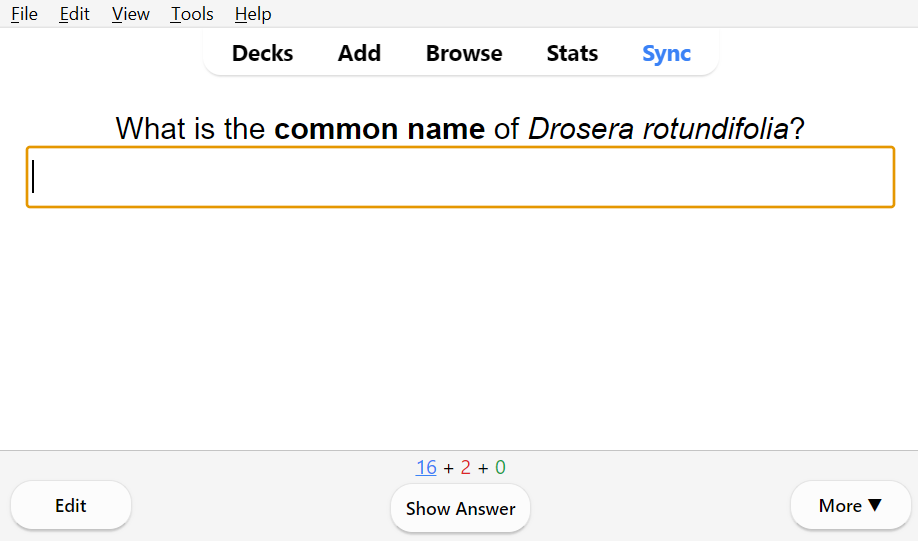
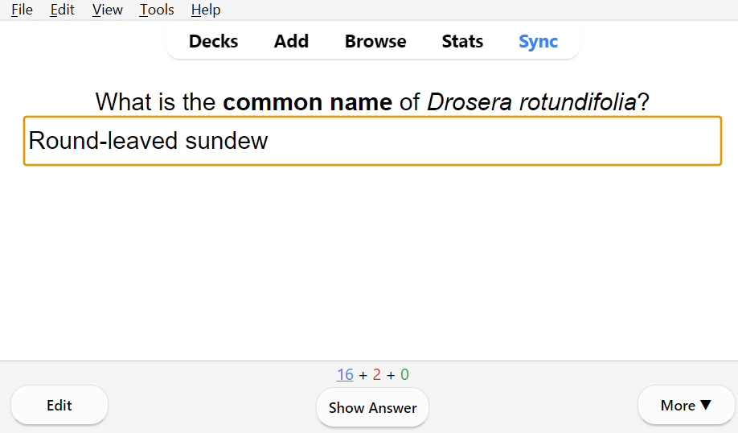
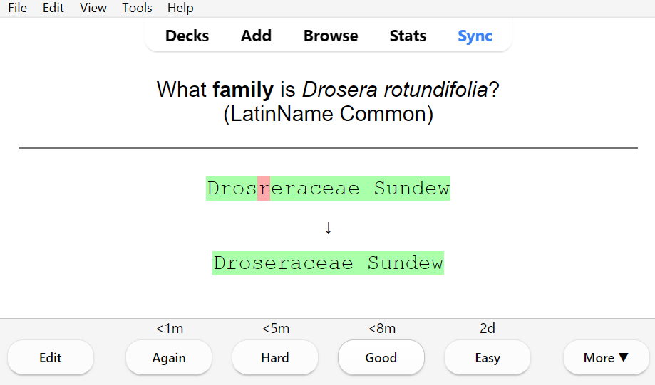
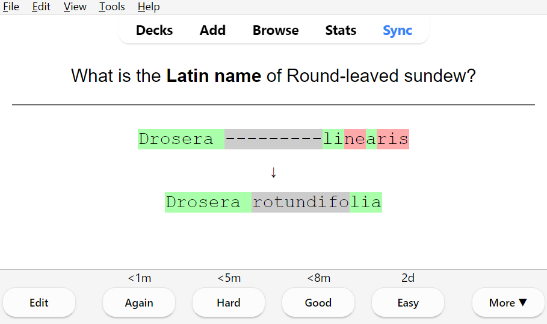

# Examples of Anki flashcards
Here is what a flashcard looks like at first, there is an empty text box for you to type in the answer. You type the answer into the text box, and your answer is highlighted in green if it is correct.   

    
  
    

If you typed in an answer that you know to be technically correct, but isn't exactly what is listed (e.g. Drosera rotundifolia is sometimes called roundleaf sundew, which would be marked incorrect since it is expecting Round-leaved sundew), then you can still mark the card as "easy", which tells Anki that you got it correct and are confident in your answer. 
 
 
The text highlighting doesn't determine whether your answer is registered as correct, that's up to you.   

## More Examples
 
Here are two different cards for family name. For the first one, there is no common name for the family. Note that the question includes (LatinName), which tells you which format of family name the card is expecting. 

The second card has both a Latin family name and a common one. This card includes (LatinName Common), to tell you the format that you should type in your answer, and to let you know that this card wants both.   

    
  

 
Here is an example where you are provided with the common name and type in the Latin name.   
    

## What if you answer incorrectly?   
Any letters that don't belong will be highlighted in red, and you can compare it to the correct answer below.  
   

Here's another example, where the wrong specific epithet was entered. The genus is in green, since it is correct, but the rest of the input is wrong.  
  

