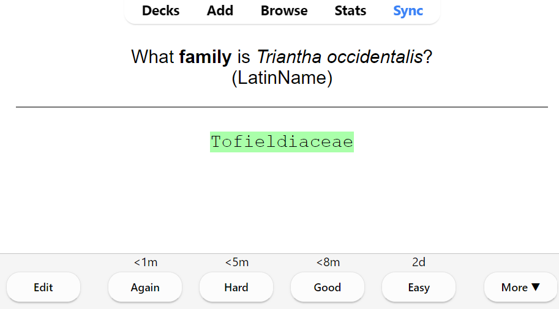
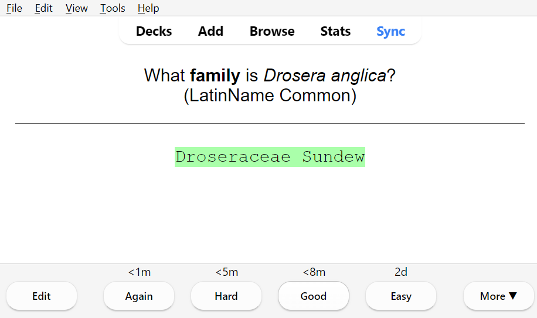
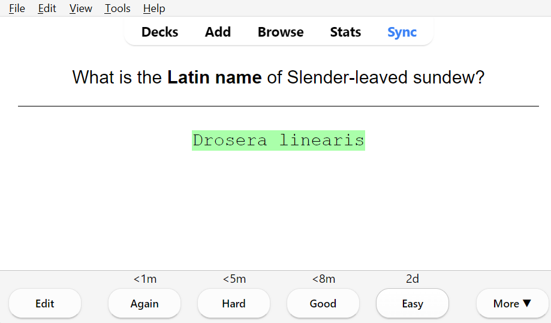
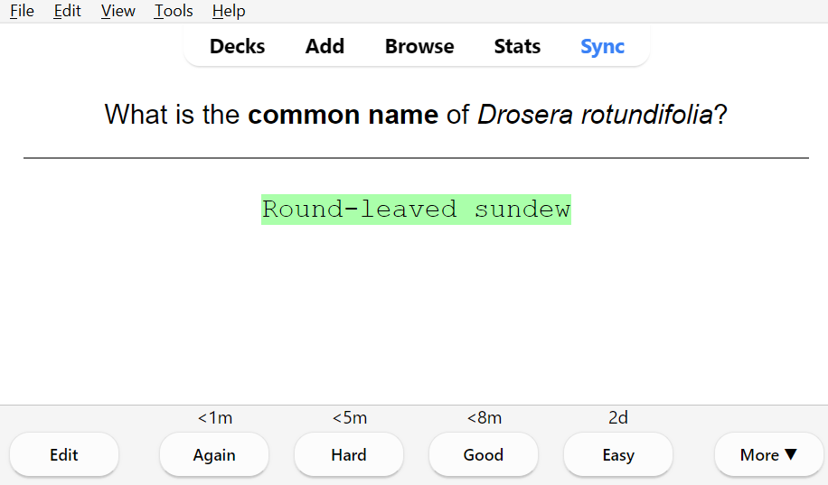

# Scientific Name Flashcards
This code turns a spreadsheet (in csv form) into <b>fill-in-the-blank</b> Anki flashcards for learning species Latin names, common names, family, and other information. This code could likely be adapted work with many other flashcard apps, since it creates a .txt file output.

[Here is an example of the input csv](/Example-Data/SamplePlantSpreadsheet.csv)  
[Here is an example of the output text file](/Example-Data/SampleFlashcardOutput.txt) that is imported into Anki  

Here are some images of the Anki flashcards made with this example data. For more of my flashcard examples, see [this guide](/Example-Data/ExampleFlashcards.md)

    
 
    
    

## Background
I wrote this code to help me learn the spellings of plant latin names, and also match the latin names for each species to a common name and family. I initially wrote this in python and learned python for this project. It worked so well that I am uploading it so that other students may benefit, for plant ID courses or for any similar application requiring the memorization of scientific and common names. 

## [The Python Version](Python-Flashcard-Code)
Please note that I learnt Python specifically for this project. It's almost definitely a mess, and there are probably more efficient ways to do this, but I don't really care and am not currently planning on updating the Python code. If you're trying to make sense of the Python code, my apologies in advance, and I can't help you because I no longer remember what I did. You're on your own. 

## [The R Version](R-Version/R-Flashcard-Code-Main.R)
I have made a new version in R, and this is the version that I will continue to update because I actually use R consistently and understand its syntax better. In my experience, R is also used by many students in biology so people who would benefit from this project would be more likely to know how to run R code. See [this general guide](R-Version/README.md) for detailed information on how to format your data, and what the different variables mean. 
Information on importing your cards to Anki will be added soon. 
The R version is now fully functional. 

## For Absolute Beginners
There will eventually be a guide here on how to use the R version of the code if you are an absolute beginner. One of the issues that I ran into while making this project was that I knew what my code needed to do, and I knew that there were likely other poeple who had done similar things, but even if I had found a project for this exact purpose, I wouldn't have known how to run their code. In the meantime, [the general guide should help](R-Version/README.md)

If you know how to run the python code, it is very user friendly, and will prompt you at each step. As far as I am aware, you shouldn't need to edit anything inside the code for it to work, all settings that you change are done by user input when prompted. 

## Importing the cards to Anki
Anki is a flashcard software that automatically schedules cards to be reviewed at different intervals depending on how difficult they are (based on your rating). It has a lot of very useful functions, including the typed answer format of cards. After you have run this code, you will have your card data in a .txt file, which you must now import to Anki:
1. From the Anki main menu, go to File > Import, and select the text file.
2. This will open the Import File menu, with many different settings. <b> If you are using the R version of the code, you should not have to change anything on this page except for the Deck </b>. These setting should be selected: Field separator is comma, Allow HTML in fields as True, Field mapping should map the labels, and Note Type should be Basic (type in the answer), although you can change it if you want.
3. Select the Deck
4. Import notes
5. Return to the main menu, and try your flashcards!  

[<b>Here are some examples of how the completed flashcards look!</b>](/Example-Data/ExampleFlashcards.md)

## Feedback
Any feedback on this project is greatly appreciated! I'm still learning how to use R and GitHub, so please let me know about errors that you notice.
